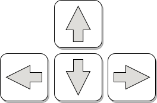
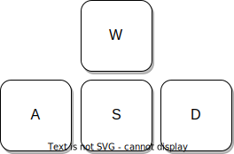
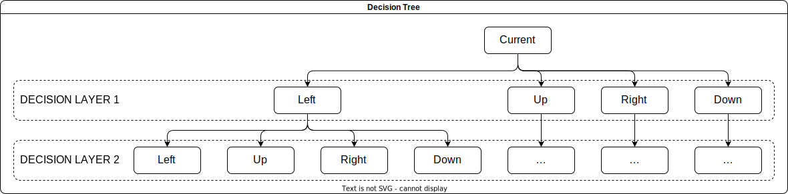

<!--<style>
    .matrix-2048{
        border-collapse: collapse;
        
    }
    .matrix-2048 tr{
        width: 64px;
    }

    .matrix-2048 td{
        border: 2px solid grey;
        width: 36px;
        height: 36px;
        padding: 0;
        text-align: center;
        font-weight: bold;
    }

    h1, h2, h3, h4, h5 {
        border-bottom: 2px solid grey !important;
        width: 100%
    }
</style>!-->

# solve2048
Solving 2048 game with fixed algorithm

## 1. What is 2048

2048 is a game that allows players to **move** the block. The same block would **merge** when they touch each other and the value of the block will be doubled. Meanwhile, some **randomly generating blocks will be added to the matrix**, the value of it will be 2 (for most times) or 4. Players win if they manage to **obtain block 2048**(`2^11`), that might be why it is called 2048. If they cannot get block 2048 **until the matrix is full of blocks**, they would lose the game.

This game emphasises some special strategies for players, such as:
- DO NOT move the block out of the matrix
- SHOULD combine the blocks as much as possible
- SHOULD calculate some steps or some moves in advanced after each process.

## 2. How to play 2048
There are two ways to move the **entire** matrix.

- Using **arrow** keys

    

- Using **WASD** keys

    

The same blocks that would **touch each other after moving in the direction given by the player** will be **merged** and the value of the merged block will be **doubled**.

For example, if the matrix looks like this:

<table class="matrix-2048">
<tr><td>0</td><td>0</td><td>2</td><td>0</td></tr>
<tr><td>0</td><td>0</td><td>4</td><td>4</td></tr>
<tr><td>2</td><td>2</td><td>2</td><td>2</td></tr>
<tr><td>32</td><td>0</td><td>0</td><td>0</td></tr>
</table>

The player can then simply use the arrow keys to move the matrix to the **LEFT**, for example:


<table class="matrix-2048">
<tr><td>2</td><td>0</td><td>0</td><td>0</td></tr>
<tr><td>8</td><td>0</td><td>0</td><td>0</td></tr>
<tr><td>4</td><td>4</td><td>0</td><td>0</td></tr>
<tr><td>32</td><td>0</td><td>0</td><td>0</td></tr>
</table>

In the above matrix
- ROW 1: Block 2 is **moved** to the left.
- ROW 2: two blocks 4 are **merged** into 8 and the block 8 is **moved** to the left.
- ROW 3: although moving to the left can be outside the matrix, the four blocks 2 can be made into two blocks 4. However, only **two blocks can be merged into one at a time**.
- ROW 4: Block 32 cannot be moved in this direction because it would be **outside the matrix**.

As expected, this matrix cannot be moved any further upwards as it would be out of the matrix and none of the blocks can be be merged anymore.

## How to solve 2048 by using algorithm?

### **TYPES** defined as prerequisite

- `VerticalHorizontal_Array`

    This type is defined as a array (list), containing the score of the horizontal direction and vertical direction. 

    ```
    VerticalHorizontal_Array = [
        <score_horizontal>, 
        <score_vertical>
    ]
    ```

- `directionsArray`

    This type is defined as a array (list), containing the direction (left, top, right, bottom) of the matrix.

    ```
    directionsArray = [
        <up_score>, 
        <left_score>, 
        <down_score>, 
        <right_score>
    ]
    ```

### Method 1 - Calculating **step-by-step**

Collecting the data from the matrix directly

#### Collecting **information**

The purpose of this method is to **filter out unfeasible directions and select the best direction of movement**.

The information collected should be able to indicate a better moveable direction. Filtering out the **moveable directions is done by `NFR` and `NSB`**, and the **better directions are indicated by `NCD`**. *(All of these aspects are going to be described in more detail below)*

#### **Aspects**:

- **Number of operationally feasible rows (columns) in the horizontal (vertical) direction (`NFR`)**
    
    Determine which direction, whether it is feasible

    It returns the value in a `directionsArray` type format. 
    
    The direction is **considered feasible** in the following situations (the direction to move in is LEFT):

    - There is some space to move the block:

        <table class="matrix-2048">
        <tr><td>0</td><td>0</td><td>2</td><td>0</td></tr>
        <tr><td>0</td><td>0</td><td>0</td><td>0</td></tr>
        <tr><td>0</td><td>0</td><td>0</td><td>0</td></tr>
        <tr><td>0</td><td>0</td><td>0</td><td>0</td></tr>
        </table>

    - There are some combinable blocks in this direction

        <table class="matrix-2048">
        <tr><td>2</td><td>2</td><td>0</td><td>0</td></tr>
        <tr><td>0</td><td>0</td><td>0</td><td>0</td></tr>
        <tr><td>0</td><td>0</td><td>0</td><td>0</td></tr>
        <tr><td>0</td><td>0</td><td>0</td><td>0</td></tr>
        </table>

    - In the example above, `NFR` gives the result `[0, 0, 2, 0]`. There are two columns that can be moved down and one row that can be moved to the right.

    ***NOTICE:***
    
    - If **one of these two** criteria is met, the direction will be judged to be **feasible**.

    - This situation will return 0 in the LEFT direction. It will **ignore the combinable blocks in that direction**, since the combinable direction check is the function of `NCD`.

        <table class="matrix-2048">
        <tr><td>2</td><td>2</td><td>0</td><td>0</td></tr>
        <tr><td>0</td><td>0</td><td>0</td><td>0</td></tr>
        <tr><td>0</td><td>0</td><td>0</td><td>0</td></tr>
        <tr><td>0</td><td>0</td><td>0</td><td>0</td></tr>
        </table>

- **Number of Combinable squares of the same value in different Directions (`NCD`)**

    Evaluate the score of each direction according to the value of the **combinable** squares **in the horizontal/vertical direction**. The score is the number of combinable squares in that direction.

    It returns the scores in the format of type `VerticalHorizontal_Array`. Since **both** moving to the left and moving to the right can combine blocks, there is **no need to score them separately**.

    The score for each direction is the **logarithm** of the value of the combinable blocks (in that direction) with **base 2**. If there are several groups that can be combined separately, **the sum of their values**, calculated separately, gives the score for that direction.

    Suppose the matrix of 2048 is as follows

    <table class="matrix-2048">
    <tr><td>2</td><td>4</td><td>4</td><td>0</td></tr>
    <tr><td>2</td><td>0</td><td>0</td><td>0</td></tr>
    <tr><td>0</td><td>0</td><td>0</td><td>0</td></tr>
    <tr><td>0</td><td>0</td><td>0</td><td>0</td></tr>
    </table>

    It will return the value `[2, 1]`

- **Number of Squares at the Boundary (`NSB`)**
    
    The purpose of this function is to get the **current distribution** of blocks in the matrix, similar to the `NFR` function, but this function can **complement** `NFR`.

    It returns the value in the **format of type `directionsArray`**, the elements in the array being the number of blocks at the boundary in the direction **corresponding** to the index.

    To illustrate, if the matrix of 2048 is as follows:

    <table class="matrix-2048">
    <tr><td>0</td><td>0</td><td>0</td><td>0</td></tr>
    <tr><td>4</td><td>2</td><td>0</td><td>0</td></tr>
    <tr><td>4</td><td>0</td><td>0</td><td>0</td></tr>
    <tr><td>0</td><td>2</td><td>0</td><td>0</td></tr>
    </table>

    The program will produce the following results:

    - `NFR` would give this result: `[2, 1, 2, 3]`.
    
    - `NCD` would give this result: `[0, 2]`.

    From this we can deduce that we should move **UPWARD** or **DOWNWARD**, since we can move in these directions (result of `NFR`) and combine the most blocks (result of `NCD`). 
    
    However, from practical experience, players **prefer to keep all blocks in one corner or on one side**. The direction UPWARD and DOWNWARD are **equally feasible** if the program only refers to `NFR` and `NCD`. 
    
    According to practical experience, **DOWNWARD should be chosen** .
    
    In order to **identify which direction is better (to follow this practice)**, another function `NSB` is needed. It counts the number of **blocks on each side**, and decide the direction to move.

    In this example `NSB` would return this result: `[0, 2, 1, 0]`, we can combine this data and get the final result, which is DOWNWARD (`1 > 0`).

The values taken can roughly reflect the current situation, but weights are needed to improve the decision.

#### Weights <p style="float:right">(related to the old project - 2048.ts)</p>

The values collected for each aspect are of **different importance**. For example, `NFR` is much more important than any other aspect because the **priority** of the algorithm is to filter out the feasible directions.

The initial weighting is as follows, which can be changed by the user or by the algrithm itself (evolution):

| ASPECT NO. | INITIAL WEIGHT |
|:---:|:---:|
| `NSB` |(face the direction with the most boxes) <br> this: 1, side: 2, opposite: 1 |
| `NFR` | 4 |
| `NCD` | 16 |

#### Process

Suppose the matrix of 2048 is as follows:

<table class="matrix-2048">
<tr><td>8</td><td>4</td><td>0</td><td>0</td></tr>
<tr><td>2</td><td>0</td><td>0</td><td>0</td></tr>
<tr><td>2</td><td>0</td><td>0</td><td>0</td></tr>
<tr><td>0</td><td>0</td><td>0</td><td>0</td></tr>
</table>

The process is as follows:
- **Collect** the information

    - `NFR`: **count how many rows(columns)** can be moved in each direction, the result will be `[1, 0, 2, 3]`.

        - **TOP**: Two 2 blocks can be combined, but there is no space to move further. So the value of column is `1`.
        - **LEFT**: No blocks can be combined and no square can be moved.
        - **BOTTOM**: All blocks can be moved, as there are many zero blocks 
        - **RIGHT**: All blocks can be moved, as there are many null blocks.

    - `NCD:` Give the current value `[0, 1]`.

        - VERTICAL: two blocks 2 can be combined

    - `NSB`: Count the number of blocks on each side, the result will be `[2, 3, 0, 0]`.

        - **TOP**: Block 8 & block 4.
        - **LEFT**: Block 8 & two blocks 2.
        - **BOTTOM**: No blocks .
        - **RIGHT**: No blocks.

- **Select** the direction

    The data collected in the first step are **multiplied by the weights** to get the scores of each branch.

    The direction with the **highest score** at the end will be selected.

- **Move** the matrix in that direction

   Move the matrix by **sending the signal of the corresponding key** to make it look like the player is pressing the key.

#### Optimizing the weights

- The weight can be optimised by the process using the specially designed algorithm which **generates the pairs of weights which are slightly different** from the current weights. 

- Then the algorithm will **test** the decision making ability **many times** to **get the most optimised weights** in the generated pairs. The optimised weights will be **put back** to the algorithm **for the next iteration** to get further improvement.

- The whole process is like evolution in nature, so it can also be called "evolution of weights".

### Method 2 - Iterate through the entire selection tree

- The algorithm imagines what the **matrix would look like for each possible decision**. This creates a set of **potential future matrices**, which are expected to be the matrices **after each decision has been made**.

- It then evaluates each potential future matrix and assigns it a score **based on how favourable it appears** (can combine how many blocks, the value of the combinable blocks). The higher the score, the better the potential outcome.

- To make even smarter decisions, the function **repeats this process for a few more steps into the future**. It collects the outcome of each branch and the outcomes of branches of each branch to create a decision tree. The decision tree represents all the possible paths and outcomes that the game could take.

- By considering the scores assigned to the potential game boards at each step, the algorithm selects the direction that **may lead to the most favourable outcome**.

The program works as follows:

Suppose the matrix of 2048 is as follows, **ignoring** the random block factor:

<table class="matrix-2048">
<tr><td>8</td><td>4</td><td>0</td><td>0</td></tr>
<tr><td>2</td><td>0</td><td>0</td><td>0</td></tr>
<tr><td>2</td><td>0</td><td>0</td><td>0</td></tr>
<tr><td>0</td><td>0</td><td>0</td><td>0</td></tr>
</table>

- If it is moved **UP**, the matrix will look like this:

    <table class="matrix-2048">
    <tr><td>8</td><td>4</td><td>0</td><td>0</td></tr>
    <tr><td>4</td><td>0</td><td>0</td><td>0</td></tr>
    <tr><td>0</td><td>0</td><td>0</td><td>0</td></tr>
    <tr><td>0</td><td>0</td><td>0</td><td>0</td></tr>
    </table>

- If it is moved **DOWN**, the matrix will look like this:

    <table class="matrix-2048">
    <tr><td>0</td><td>0</td><td>0</td><td>0</td></tr>
    <tr><td>0</td><td>0</td><td>0</td><td>0</td></tr>
    <tr><td>8</td><td>0</td><td>0</td><td>0</td></tr>
    <tr><td>4</td><td>4</td><td>0</td><td>0</td></tr>
    </table>

- If it is moved to the **RIGHT**, the matrix will look like this:

    <table class="matrix-2048">
    <tr><td>0</td><td>0</td><td>8</td><td>4</td></tr>
    <tr><td>0</td><td>0</td><td>0</td><td>2</td></tr>
    <tr><td>0</td><td>0</td><td>0</td><td>2</td></tr>
    <tr><td>0</td><td>0</td><td>0</td><td>0</td></tr>
    </table>

- The LEFT direction is **ignored** as the **matrix cannot be moved** in this direction.

The score of each branch is based on **the score of the potential matrix divided by the depth**, as the deduction ignores the randomly generated block.

The way to evaluate which direction to move is better. The only thing to consider is the **score of the potential matrix**.

Such extrapolations are **repeated many times** on **each branch** until they **reach the limit of the given depth** of the decision tree.



The **largest** sum of the branch value in `LAYER 1`, and the sum of all branch values in `LAYER 2` and the LAYERS below, **gives the direction** in which the branch will execute.


---

LAST UPDATE: 23 NOV 2023
